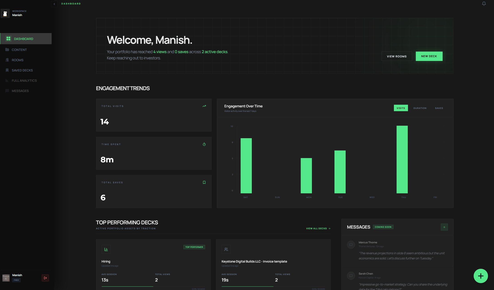

<p align="center">
  <a href="https://deckly.space">
    
  </a>
</p>

<h1 align="center">Deckly</h1>

<p align="center">
  <strong>The open-source pitch deck workspace for founders and investors.</strong>
</p>

<p align="center">
  Share investor-ready decks, protect sensitive documents, and understand engagement—all from one focused workspace.
</p>

<p align="center">
  <a href="https://deckly.space">Explore Deckly</a>
  &nbsp;·&nbsp;
  <a href="https://github.com/ManishBlueprints/Deckly">GitHub</a>
</p>

<p align="center">
  <a href="https://github.com/ManishBlueprints/Deckly/actions/workflows/ci.yml"></a>
  <a href="LICENSE"></a>
  
  <a href="https://github.com/ManishBlueprints/Deckly/stargazers"></a>
</p>

<p align="center">
  
</p>

## Why Deckly?

Deckly gives founders a polished, secure way to share fundraising materials and gives investors the context they need to evaluate them. Keep a stable link while decks evolve, organize related documents into data rooms, and turn viewer activity into actionable signals.

## Features

| | Feature | What it does |
| --- | --- | --- |
| 📤 | **Share without resend cycles** | Update a deck behind the same link, so the latest version is always available. |
| 🗂️ | **Purpose-built data rooms** | Group decks and supporting materials for structured fundraising or review workflows. |
| 🔐 | **Access controls** | Protect material with password gates, expiry dates, download controls, and optional email capture. |
| 📈 | **Engagement analytics** | See views, time spent, slide-level drop-offs, saves, and revisit signals. |
| ✨ | **Investor-focused AI summaries** | Generate concise summaries to help reviewers understand a deck faster. |
| 📝 | **Private investor workspace** | Save decks, add notes, tag startups, and return to opportunities with full context. |
| 📱 | **Fast everywhere** | Browse responsive, app-like slide viewing experiences on desktop and mobile. |
| 🛡️ | **Privacy-first foundation** | Use client-side PDF rendering, minimal data collection, and row-level security controls. |

## How it works

1. **Upload and organize** your pitch decks and supporting material.
2. **Share a protected link** or assemble a data room for a fundraising process.
3. **Track engagement** to understand which viewers and slides are attracting attention.
4. **Iterate confidently** by updating the document without changing its share URL.

## Tech stack

- **Frontend:** React 19, Vite, and TypeScript
- **UI:** Tailwind CSS, shadcn/ui, and Radix UI
- **Backend:** Supabase Auth, PostgreSQL, Row Level Security, Storage, and Edge Functions
- **Data fetching:** TanStack Query
- **Document processing:** pdf.js in the browser and CloudConvert for supported office documents
- **Storage and delivery:** Cloudflare R2
- **Observability:** PostHog and Sentry

## Quick start

### Prerequisites

- Node.js 24 or newer
- Docker, for local Supabase development
- Supabase CLI, available through `npx supabase` or a global installation

### 1. Clone and install

```bash
git clone https://github.com/ManishBlueprints/Deckly.git
cd Deckly
npm install
cp .env.example .env.local
```

### 2. Configure the app

At minimum, add your Supabase project details to `.env.local`:

```bash
VITE_SUPABASE_URL=http://127.0.0.1:54321
VITE_SUPABASE_PUBLISHABLE_KEY=your_local_publishable_key
```

See [`.env.example`](.env.example) for optional analytics, storage, document-processing, email, and billing configuration. Never commit real secrets.

### 3. Bootstrap Supabase

For a local stack:

```bash
npm run supabase:bootstrap -- local
```

For a fresh linked Supabase project:

```bash
npx supabase login
npm run supabase:bootstrap -- remote --project-ref YOUR_PROJECT_REF
```

The bootstrap command links the target project, applies migrations, loads the minimal seed data, and verifies the installation. Provide `SUPABASE_DB_PASSWORD` and optionally `SUPABASE_ADMIN_EMAIL` when bootstrapping a remote project.

### 4. Start developing

```bash
npm run dev
```

Open the Vite URL printed in your terminal, normally `http://localhost:5173`.

## Self-hosting and deployment

Deckly is designed to run in your own Supabase project. The executable database history lives in [`supabase/migrations/`](supabase/migrations/); [`supabase/schema.sql`](supabase/schema.sql) is a readable reference, not a provisioning script.

For a production deployment:

1. Create and bootstrap a Supabase project with the remote command above.
2. Configure the browser-safe variables and required Edge Function secrets from [`.env.example`](.env.example).
3. Configure Cloudflare R2 and CloudConvert if you need private asset delivery or office-document conversion.
4. Build and deploy the Vite app through your preferred static host.

## Quality checks

Run the same checks used by continuous integration before opening a pull request:

```bash
npm run type-check
npm run lint
npm test
npm run build
```

### Docker development

```bash
docker-compose up
```

The application will be available at `http://localhost:5173`.

## Contributing

Contributions are welcome. Please open an issue to discuss substantial changes, fork the repository, create a focused branch, and submit a pull request using the included template. Before submitting, run the [quality checks](#quality-checks) and describe how you tested the change.

## License

Deckly is available under the [GNU Affero General Public License v3.0](LICENSE).

Under AGPL-3.0 Section 13, if you modify Deckly and make that modified version available for users to interact with over a network, you must offer those users access to the corresponding source code of your version. A visible source link in your deployed application is a practical way to meet this obligation.

---

Built for founders and investors who want a better way to share the story behind a company.
